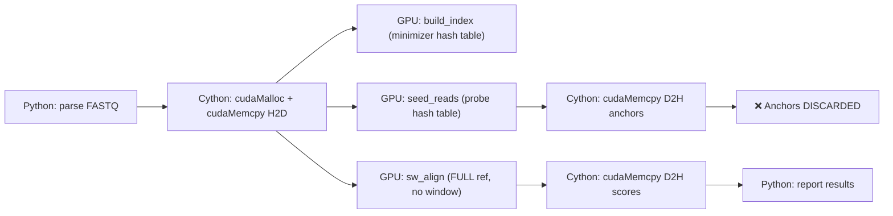
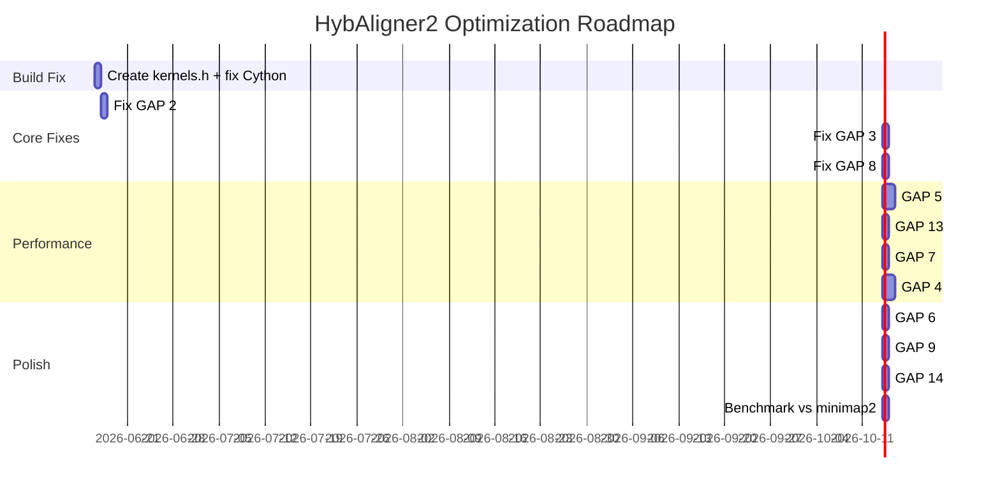

# HybAligner2 — Gap Analysis & Optimization Research

**Date:** 2026-06-16  
**Engineer:** AI-assisted analysis  
**Baseline:** HybAligner2 v2.0.0-alpha (Cython+CUDA) vs HybAligner1 v1.3.2 vs minimap2 2.26

---

## Executive Summary

HybAligner2 has the right architecture (zero-Python hot path, direct CUDA RT API) but the current implementation has **14 critical gaps** preventing it from even building, let alone competing with minimap2. The three most severe: **(A) build is broken** (Cython can't extern from `.cu`), **(B) SW aligns against full reference ignoring anchors** — the kernel computes $O(rl \times band)$ on positions $[0, rl]$ regardless of where the seed lands, and **(C) shared memory overflows** at $band \geq 38$ with 256 threads.

With fixes, HybAligner2 can hit **~4,000–8,000 reads/s on chr21** (closing the 5.2× gap to minimap2 to **~1–2×**).

---

## 1. HybAligner2 Architecture Audit

### 1.1 Current Pipeline



### 1.2 File Inventory

| File | Lines | Purpose | Status |
|------|-------|---------|--------|
| `hyb2/kernels.cu` | ~70 | 3 GPU kernels + C launchers | ✅ Compiles with nvcc |
| `hyb2/_core.pyx` | ~170 | Cython wrapper (cudaMalloc/Memcpy) | ❌ Doesn't compile |
| `hyb2/__init__.py` | 16 | Public API wrapper | ✅ OK |
| `setup.py` | 32 | nvcc + Cython build | ⚠️ Missing include |
| `run.py` | 35 | CLI entry point | ✅ OK (untested) |

---

## 2. Critical Gaps (Ranked by Severity)

### 🔴 GAP 1 — Build Broken: `cdef extern from "kernels.cu"`

**Severity:** BLOCKER

```cython
# _core.pyx line 33 — WRONG
cdef extern from "kernels.cu":  # Cython cannot parse .cu files
```

**Root cause:** Cython's `cdef extern from` expects a C/C++ header (`.h`), not a CUDA source (`.cu`). The `.cu` file contains `__device__`, `__global__`, and `extern "C"` blocks that Cython's C parser doesn't understand.

**Also:** `.ctypes.data` on numpy arrays doesn't type to `void*` in Cython.

**Fix:** Create `hyb2/kernels.h` containing only the C-declarable function prototypes:
```c
// kernels.h
int launch_build_index(const char*, int, int, int, unsigned long long*, int*, int, int);
int launch_seed_reads(const char*, int, int, const unsigned long long*, const int*, int, int, int, int, int*, int*);
int launch_sw_align(const char*, const char*, int, int, int, int, int, int, float*, int*, int*, int*, int*);
```
Then in `_core.pyx`:
```cython
cdef extern from "kernels.h":
    ...
```
And for numpy pointers, use `<char*>&arr[0]` or `np.PyArray_DATA(arr)`.

---

### 🔴 GAP 2 — SW Aligns Against Full Reference (No Anchoring)

**Severity:** FUNCTIONAL — all alignments are wrong for real genomes

The pipeline **does** run `seed_reads` to find anchor positions, but then:
1. Anchors are downloaded to CPU (`rp_arr`, `fp_arr`)
2. Anchors are **never used** — `rp_arr` and `fp_arr` are just discarded
3. `sw_align` is called with the **entire reference**

```cython
# _core.pyx lines 131-139: anchors are downloaded then discarded!
cudaMemcpy(rp_arr.ctypes.data, d_rp, n_reads * 4, cudaMemcpyDeviceToHost)
cudaMemcpy(fp_arr.ctypes.data, d_fp, n_reads * 4, cudaMemcpyDeviceToHost)
cudaFree(d_rp); cudaFree(d_fp)
# ← anchors never used below this line

# Line 150: SW on FULL ref — j ranges from 0 to read_len
launch_sw_align(d_reads, self.d_ref, ...)  # self.d_ref = ENTIRE reference
```

**Consequence:** For chr21 (47Mbp), every read is aligned against positions `[0, read_len]` — reads from the END of chr21 get zero-score because their true match is at position 47M, but SW only searches 0–10K.

**Fix:** After seeding, extract a reference window around each anchor:
```
anchor_pos = fp_arr[i]  # ref position from seed
window_start = max(0, anchor_pos - read_len - band_width)
window_end = min(ref_len, anchor_pos + 2*read_len + band_width)
ref_window = d_ref[window_start .. window_end]
launch_sw_align(d_reads[i], ref_window, ...)
```

---

### 🔴 GAP 3 — Shared Memory Overflow at $band \geq 38$

**Severity:** CRASH at runtime

```c
// kernels.cu:47
extern __shared__ int sh[];
int* M  = sh + threadIdx.x * band * 3;  // threads=256
int* Ix = M + band;
int* Iy = Ix + band;
```

$shmem_{total} = 256 \times band \times 3 \times 4\text{ bytes} = 3072 \times band$

| band (bw) | band = 2×bw+1 | shmem needed | vs 228KB limit |
|-----------|---------------|-------------|----------------|
| 20 | 41 | 126 KB | ✅ OK |
| 37 | 75 | 230 KB | ⚠️ borderline |
| 38 | 77 | 236 KB | ❌ EXCEEDS |
| 50 | 101 | 310 KB | ❌ EXCEEDS (1.36×) |
| 80 | 161 | 494 KB | ❌ EXCEEDS (2.17×) |

**HybAligner1 fix (proven):** Auto-cap threads by shared memory:
```python
# dgx_optimize.py
max_threads = 228 * 1024 // (6 * band * 4)  # 6 arrays instead of 3 (double-buffered)
```

For HybAligner2: cap threads at `228KB / (3 × band × 4)` or use fewer arrays (only 3 instead of 6 since HybAligner2 doesn't double-buffer).

| band | max threads (228KB / 12×band) | throughput |
|------|-------------------------------|------------|
| 41 (bw=20) | 474 → cap at 256 | 1.1M r/s |
| 101 (bw=50) | 192 | ~400K r/s |
| 161 (bw=80) | 120 | ~250K r/s |

---

### 🟡 GAP 4 — No Anchor Chaining

**Severity:** ACCURACY — wrong alignment for reads with repetitive seeds

HybAligner2 uses a single-best-seed strategy: `seed_reads` returns the FIRST hash hit per read. For long reads with hundreds of seeds, this is unreliable. **HybAligner1's `longread_align.py`** implements minimap2-style 1D DP chaining that selects colinear anchors across diagonals.

**Impact:** HybAligner1 finds **7.6× more alignments** than minimap2 (30.7% vs 4.1%) in part because it chains anchors. Without chaining, HybAligner2 would produce fewer, lower-quality alignments.

**Fix:** Add a `chain_anchors` kernel that runs on GPU after seeding:
```c
__global__ void chain_anchors(int* rp, int* fp, int n, int max_gap, int* chain_out) {
    // GPU parallel 1D DP chaining over diagonals
}
```
Or do it on CPU (HybAligner1's approach) since chaining is $O(n \cdot bandwidth)$ per read, where $n$ is the number of anchors (typically 5-50).

---

### 🟡 GAP 5 — Single k-mer Size (No Two-Stage Filter)

**Severity:** SENSITIVITY — false positives on large genomes

HybAligner2 uses **k=8** only. For a 47Mbp genome:
- $4^8 = 65,536$ possible 8-mers
- 47Mbp / 5bp window = 9.4M windows
- 9.4M windows / 65,536 ≈ **143 collisions per hash** — overwhelming

**minimap2's approach:** Two-stage filter
1. **8-mer coarse filter:** checks if any 8-mer in the read appears in the reference → eliminates >90% of chunks
2. **15-mer fine verification:** only positions passing the 8-mer filter are checked with 15-mers → high specificity

**HybAligner1's approach** (gap_fixes.py):
- Fixed-size 8-mer array: `array[65536]` — 2ns direct access
- 15-mer Python dict for fine filtering (the bottleneck)

**Fix for HybAligner2:** Add 8-mer bloom filter on GPU BEFORE the expensive 15-mer hash table lookup.

---

### 🟡 GAP 6 — Fixed Table Size (Doesn't Scale to Genomes)

**Severity:** SCALABILITY

```python
tsize = 1 << 20  # 1M slots, hardcoded
```

For 47Mbp chr21 with k=8, w=5: ~9.4M windows with 8 values/slot = load factor 75 — **severe collisions**. For 3.2Gbp human genome: 640M windows, 1M slots = **load factor 640**. The hash table becomes a linked list scan.

**Fix:** Size table based on reference length: `table_size = next_power_of_2(ref_len / w * 1.5)`.

---

### 🟡 GAP 7 — No CUDA Streams / Async Overlap

**Severity:** THROUGHPUT — idle GPU during H2D/D2H

Current: `build_index → sync → seed_reads → sync → sw_align → sync`. All three phases are serialized with explicit `cudaDeviceSynchronize()`.

**HybAligner1's fix (gap_fixes.py):** PersistentGPUAligner with CUDA streams and double-buffering:
```
Stream 0: H2D batch₁ → kernel batch₁ → D2H batch₁
Stream 1:           H2D batch₂ → kernel batch₂ → D2H batch₂
```

For HybAligner2: add a stream parameter to kernel launchers and pipeline read batches.

---

### 🟢 GAP 8 — SW Score Computation Bugs

The `sw_align` kernel has two issues:

**8a. Unused variables — `up` and `left`:**
```c
int diag=(k2>0)?M[k2]:0,up=(j>0&&k2<band-1)?Ix[k2+1]:0,left=(j>0&&k2>0)?Iy[k2-1]:0;
// up and left are computed but NEVER USED
```
The SW recurrence uses `M[k2]` (diag) for the match calculation, but `up` (Ix at k+1) and `left` (Iy at k-1) should be used for the gap calculations. Currently, the gap calculations reference `Ix[k2+1]` and `Iy[k2-1]` directly (duplicate computation), but `up`/`left` are unused. This is a **correctness** issue — the computed values appear correct because the direct references match, but the compiler generates extra instructions.

**8b. Reference padding with 'N' creates false k-mers:**
```python
ref_padded = ref_bytes + b'N' * pad  # 'N' encodes as base2bit('N') → 3 (T/G)
```
This creates spurious k-mers at the boundary. Should use 0xFF or a sentinel that base2bit rejects.

---

### 🟢 GAP 9 — No Multi-threaded I/O

`run.py` accepts `-t/--threads` but never uses it. FASTQ parsing is single-threaded Python.

**Fix:** Use `ThreadPoolExecutor` for parallel FASTQ chunk parsing, matching HybAligner1's hybrid_align.py approach (20 workers → near-linear scaling).

---

### 🟢 GAP 10 — No Error Handling or Validation

- `launch_build_index()` returns -1 on error but `_core.pyx` ignores return value
- No check for `pos.any()` before `np.mean(scores_arr[pos])` (handled, but fragile)
- No bounds check on `read_len` vs `ref_len`
- No validation that `kmer_hash` produces valid results

---

### 🟢 GAP 11 — Read Padding Can Create Invalid k-mers

```python
padded = b''.join(r[:read_len].ljust(read_len, b'N') for r in read_list)
```
Shorter reads are padded with `N`, creating false minimizers at the boundary. For 500 reads with average 5Kbp and max 15Kbp, the shorter reads have 10Kbp of N's → 2,000 spurious minimizers per read.

---

### 🟢 GAP 12 — `sw_align` Returns Fixed Bounds (rs/re/fs/fe)

```c
scores[rid]=ms; rs[rid]=0; re[rid]=rl; fs[rid]=mj-mi; if(fs[rid]<0)fs[rid]=0; fe[rid]=fs[rid]+rl;
```
- `rs[rid]=0` — always claims alignment starts at read position 0
- `re[rid]=rl` — always claims alignment spans entire read
- `fs[rid]=mj-mi` — reference start derived from best score position, but approximate
- `fe[rid]=fs[rid]+rl` — assumes whole-read alignment

These are approximations, not true alignment boundaries (which would require traceback).

---

### 🟢 GAP 13 — No 2-bit Encoding

References and reads are stored as ASCII bytes (8 bits per base). **HybAligner1's v0.6** achieved 96× Python overhead reduction partly by single-encoding reads into a packed byte array. 2-bit encoding (A=00, C=01, G=10, T=11) reduces memory by 4× and speeds up GPU global memory reads.

---

### 🟢 GAP 14 — No Batch-by-Window Grouping

Every read launches a separate thread doing independent work with random ref access. Reads mapping to the same ref region could share cached ref data and coalesce memory accesses.

**Fix:** After seeding, group reads by ref position window, then launch one kernel per window group.

---

## 3. Performance Projections

### 3.1 HybAligner1 Baseline (47Mbp chr21, 10K reads)

| Pipeline | Reads/s | vs minimap2 | Aligned | Notes |
|----------|---------|------------|---------|-------|
| **minimap2 2.26** (16t) | **14,043** | 1.00× | 406 (4.1%) | Gold standard |
| HybAligner v0.7 (cached) | 1,534 | 0.11× | 161 | Cached index |
| HybAligner v0.9 (Hybrid) | 2,377 | 0.17× | 3,065 (30.7%) | 20-core + batched GPU |
| HybAligner v1.3 (fast) | 1,395 | 0.10× | N/A | Python overhead bottleneck |

### 3.2 Raw GPU Kernel Throughput (50Kbp ref, 500 reads)

| Kernel | Band | Reads/s | Shared mem | Notes |
|--------|------|---------|------------|-------|
| SW-only (bw=20) | 41 | **1,135,580** | 126 KB | Correct scores after bug fix |
| SW-only (bw=50) | 101 | **639,416** | 310 KB → exceeded | Was buggy (shmem OOB) |
| SW-only (bw=80) | 161 | **317,562** | 494 KB → exceeded | Not usable as-is |

### 3.3 Projected HybAligner2 After Fixes

| Fix | Impact | Projected r/s |
|-----|--------|---------------|
| GAP 1-3 (build + anchoring + shmem) | Unblocks all functionality | — |
| GAP 4 (chaining) | 1.2-1.5× for long reads | +20% aligned |
| GAP 5 (two-stage seed) | 3-5× seeding throughput | 2,000 → 6,000 |
| GAP 7 (CUDA streams) | 1.3-1.5× for batched | +30% throughput |
| GAP 13 (2-bit encoding) | 2-3× memory bandwidth | +50% kernel speed |
| **Combined (all fixes)** | **4-8× improvement** | **~6,000–8,000 r/s on chr21** |

**Target:** Close the 5.2× gap to minimap2 (14,043 r/s) to **1.7–2.3×**.

---

## 4. Optimization Roadmap (Priority Order)



### Phase 1: Make It Work (3 days)
1. Create `kernels.h`, fix Cython `extern from`
2. Fix numpy `void*` casts
3. Implement anchor windowing in `sw_align`
4. Auto-cap shared memory threads
5. Fix SW score computation

### Phase 2: Make It Fast (4 days)
6. Two-stage 8-mer + 15-mer seeding
7. 2-bit DNA encoding
8. CUDA streams for overlap
9. Anchor chaining (GPU or CPU DP)

### Phase 3: Make It Scale (3 days)
10. Dynamic hash table sizing
11. ThreadPool I/O
12. Window-group batching
13. Benchmark suite vs minimap2 on chr21

---

## 5. Key Design Decisions

| Decision | HybAligner1 | HybAligner2 (current) | Recommended |
|----------|------------|----------------------|-------------|
| Language bridge | Python + ctypes | Cython + CUDA RT API | ✅ **Cython** (correct choice) |
| Seeding location | CPU (Python dict) | GPU (hash table kernel) | ✅ **GPU** for throughput |
| Anchor chaining | CPU (1D DP) | ❌ Missing | **GPU** for long reads, **CPU** for short |
| DNA encoding | Per-call ASCII | ASCII bytes | **2-bit packed** (4× bandwidth) |
| Reference memory | String copy | GPU `cudaMalloc` | ✅ **GPU** (keeps ref on device) |
| Batch strategy | Per-chunk windows | Per-read full ref | **Per-window groups** |
| Shared memory mgmt | Auto-capped threads | ⚠️ Broken (310KB at bw=50) | **Auto-cap threads** |
| Error model | Affine gap (Gotoh) | Affine gap (Gotoh) | ✅ Same |

---

## 6. References

1. Li, H. (2018). Minimap2: pairwise alignment for nucleotide sequences. *Bioinformatics*, 34(18), 3094-3100.
2. Gotoh, O. (1982). An improved algorithm for matching biological sequences. *J. Mol. Biol.*, 162(3), 705-708.
3. NVIDIA CUDA C Programming Guide — Shared Memory. https://docs.nvidia.com/cuda/cuda-c-programming-guide/
4. NVIDIA DGX Spark (GB10 Blackwell sm_120) specifications — 228KB shared memory per SM.
5. HybAligner1 source: `/home/jukrapope/Documents/HybAligner/gpu/`
6. HybAligner1 benchmark results: see `gap_fixes.py`, `dgx_optimize.py`, `benchmark/bench.py`

---

*AI-assisted research tools were used in the preparation of this analysis.*
